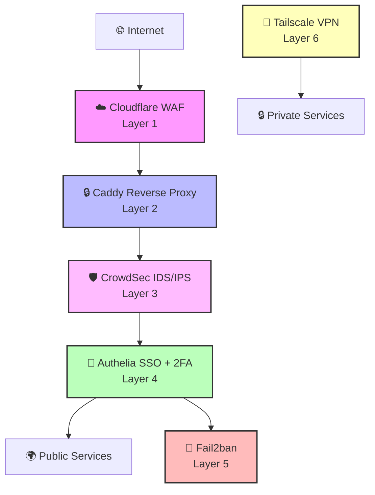
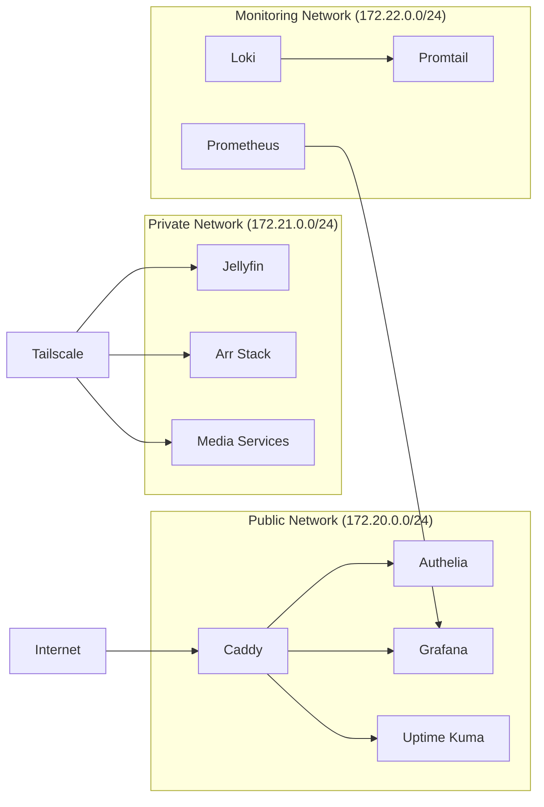
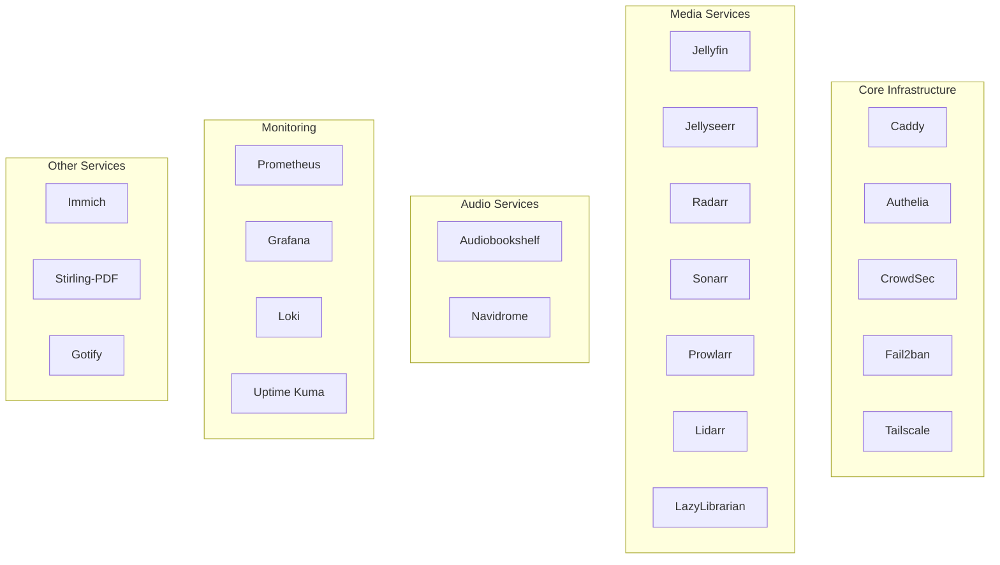

# 🏠 Secure Homelab Infrastructure

<div align="center">


**A production-ready, maximum-security homelab infrastructure with defense-in-depth architecture, zero-trust access controls, and full observability.**

[🚀 Quick Start](#-quick-start) • [📖 Documentation](#-documentation) • [🏗️ Architecture](#️-architecture) • [🔒 Security](#-security)

</div>

---

## 📋 Table of Contents

<details>
<summary>Click to expand</summary>

- [🎯 Features](#-features)
- [🚀 Quick Start](#-quick-start)
- [🏗️ Architecture](#️-architecture)
- [📦 Services](#-services)
- [⚙️ Configuration](#️-configuration)
- [🚢 Deployment](#-deployment)
- [📊 Monitoring](#-monitoring)
- [🔒 Security](#-security)
- [🛠️ Maintenance](#️-maintenance)
- [🐛 Troubleshooting](#-troubleshooting)
- [📚 Documentation](#-documentation)

</details>

---

## 🎯 Features

### 🔐 Security
- ✅ **6-Layer Defense-in-Depth** - Cloudflare WAF → Caddy → CrowdSec → Authelia → Fail2ban → Tailscale
- ✅ **Zero-Trust Access Control** - SSO with 2FA for all services
- ✅ **Automated Threat Detection** - CrowdSec IDS/IPS with community blocklists
- ✅ **TLS 1.3 Encryption** - Automatic SSL certificates via Let's Encrypt
- ✅ **Security Scanning** - Automated vulnerability scans via GitHub Actions

### 🏗️ Infrastructure
- ✅ **Docker-based** - Containerized services with resource limits
- ✅ **Network Segmentation** - Isolated networks for public/private/monitoring
- ✅ **High Availability** - Health checks and automatic restarts
- ✅ **Resource Optimized** - Runs on 4GB RAM Hetzner server
- ✅ **Hetzner Storage Box** - Mounted network storage for media

### 📊 Observability
- ✅ **Full Metrics Stack** - Prometheus + Grafana + cAdvisor
- ✅ **Centralized Logging** - Loki + Promtail for log aggregation
- ✅ **Real-time Alerts** - Gotify push notifications
- ✅ **Service Monitoring** - Uptime Kuma for availability tracking

### 🤖 Automation
- ✅ **CI/CD Pipeline** - Automated deployments via GitHub Actions
- ✅ **Automated Backups** - Daily backups to Storage Box
- ✅ **Zero-Downtime Updates** - Rolling deployments
- ✅ **Automated Security Scans** - Weekly vulnerability checks
- ✅ **Python CLI Tools** - Modular homelab management tools

<!-- AUTO-GENERATED STATS - DO NOT EDIT MANUALLY -->
<!-- AUTO-GENERATED STATS - DO NOT EDIT MANUALLY -->
<!-- AUTO-GENERATED STATS - DO NOT EDIT MANUALLY -->
<!-- AUTO-GENERATED STATS - DO NOT EDIT MANUALLY -->
<!-- AUTO-GENERATED STATS - DO NOT EDIT MANUALLY -->
<!-- AUTO-GENERATED STATS - DO NOT EDIT MANUALLY -->
<!-- AUTO-GENERATED STATS - DO NOT EDIT MANUALLY -->
<!-- AUTO-GENERATED STATS - DO NOT EDIT MANUALLY -->
<!-- AUTO-GENERATED STATS - DO NOT EDIT MANUALLY -->
<!-- AUTO-GENERATED STATS - DO NOT EDIT MANUALLY -->
<!-- AUTO-GENERATED STATS - DO NOT EDIT MANUALLY -->
<!-- STATS_START -->

**Last Updated**: 2026-01-17 00:19:03 UTC | **Commit**: [a970c13](https://github.com/RodCyb3Dev/homelab/commit/a970c13) | **Branch**: main

## 📊 Quick Statistics

| **Metric**        | **Count** | **Details**                                              |
| ----------------- | --------- | ------------------------------------------------------------- |
| **Total Files**   | 156       | [📈 Full Analysis](../../wiki/Project-Statistics)             |
| **Code Lines**    | 18263+   | [🏗️ Architecture Overview](../../wiki/Architecture-Overview) |
| **Python**        | 39 files | 4552 lines                                                  |
| **YAML**          | 45 files  | 7460 lines                                                   |
| **Shell Scripts** | 4 files | 357 lines                                                  |
| **Documentation** | 20 files  | [📚 Documentation Index](../../wiki/Documentation-Index)      |
| **Docker Services** | 0 services | 7 compose files |

### 🚀 Key Components

| **Component**        | **Files** | **Purpose**         |
| -------------------- | --------- | ------------------- |
| **Python Tools**     | 39       | CLI & automation     |
| **Ansible Playbooks** | 19       | Infrastructure as code   |
| **Config Directories**   | 32        | Service configurations |

---

📚 **[View Complete Analytics in Wiki →](../../wiki/Home)**  
🔍 **[Detailed Statistics →](../../wiki/Project-Statistics)**  
🏗️ **[Architecture Overview →](../../wiki/Architecture-Overview)**

<!-- STATS_END -->

---

## 🚀 Quick Start

### Prerequisites

- **Server**: Hetzner Cloud (4GB+ RAM recommended)
- **OS**: Ubuntu 22.04 LTS
- **Docker**: 24.0+ and Docker Compose 2.20+
- **Domain**: With DNS pointing to server IP
- **Cloudflare**: Account with API token
- **GitHub**: Account (for CI/CD)

### Installation

<details>
<summary><b>📝 Step-by-Step Setup</b></summary>

#### 1. Clone Repository

```bash
git clone https://github.com/your-username/homelab.git /opt/homelab
cd /opt/homelab
```

#### 2. Configure Environment

```bash
# Copy environment template
cp .env.example .env

# Edit with your values
nano .env
```

#### 3. Generate Secrets

```bash
make generate-secrets
make setup-caddy
```

#### 4. Mount Storage Box (Optional)

```bash
# Using homelab-tools
python3 -m homelab_tools storage mount --box main
```

#### 5. Deploy Infrastructure

```bash
# Using Ansible (recommended)
make ansible-deploy-core

# Or manually
docker compose up -d
```

#### 6. Verify Deployment

```bash
make health
# or
python3 -m homelab_tools health check
```

</details>

---

## 🏗️ Architecture

### Security Layers



### Network Architecture



### Service Stack Overview



---

## 📦 Services

### 🌍 Public Services (Caddy + Authelia)

| Service | URL | Purpose | Auth |
|---------|-----|---------|------|
| **Caddy Admin** | `https://caddy.rodneyops.com` | Reverse proxy monitoring | 2FA (Admins) |
| **Authelia** | `https://auth.rodneyops.com` | SSO authentication | Password + 2FA |
| **Grafana** | `https://grafana.rodneyops.com` | Metrics & dashboards | 2FA |
| **Uptime Kuma** | `https://status.rodneyops.com` | Service status page | 2FA |
| **Gotify** | `https://rodify.rodneyops.com` | Push notifications | 1FA |
| **Navidrome** | `https://navidrome.rodneyops.com` | Music streaming | 1FA |
| **Audiobookshelf** | `https://audiobooks.rodneyops.com` | Audiobook & podcast server | 1FA |

> **Note:** All services require Authelia authentication. Health check endpoints are bypassed for monitoring.

### 🔒 Private Services (Tailscale Only)

| Service | Tailscale URL | Purpose |
|---------|---------------|---------|
| **Jellyfin** | `https://anduin.kooka-lake.ts.net` | Media streaming |
| **Jellyseerr** | `https://anduin.kooka-lake.ts.net:5055` | Media requests |
| **Radarr** | `https://anduin.kooka-lake.ts.net:7878` | Movie management |
| **Sonarr** | `https://anduin.kooka-lake.ts.net:8989` | TV show management |
| **Prowlarr** | `https://anduin.kooka-lake.ts.net:9696` | Indexer manager |
| **Lidarr** | `https://anduin.kooka-lake.ts.net:8686` | Music management |
| **LazyLibrarian** | `https://anduin.kooka-lake.ts.net:5299` | Book/audiobook management |
| **qBittorrent** | `https://anduin.kooka-lake.ts.net:8080` | Torrent client |
| **Jackett** | `https://anduin.kooka-lake.ts.net:9117` | Torrent indexer |
| **Bazarr** | `https://anduin.kooka-lake.ts.net:6767` | Subtitle manager |
| **Flaresolverr** | `https://anduin.kooka-lake.ts.net:8191` | Cloudflare bypass |
| **Audiobookshelf** | `https://gandalf.kooka-lake.ts.net` | Audiobook server (Tailscale) |
| **Navidrome** | `https://bard.kooka-lake.ts.net` | Music server (Tailscale) |
| **Immich** | `https://immich.kooka-lake.ts.net` | Photo management |
| **Stirling-PDF** | `https://pdf.kooka-lake.ts.net` | PDF tools |

### 📊 Monitoring Services

| Service | Purpose | Access |
|---------|---------|--------|
| **Prometheus** | Metrics collection | Internal only |
| **Grafana** | Metrics visualization | `https://grafana.rodneyops.com` |
| **Loki** | Log aggregation | Internal only |
| **Promtail** | Log collection | Internal only |
| **Uptime Kuma** | Service monitoring | `https://status.rodneyops.com` |
| **cAdvisor** | Container metrics | Via Prometheus |

---

## ⚙️ Configuration

### Environment Variables

Key environment variables are defined in `.env`. See [`.env.example`](.env.example) for complete list.

<details>
<summary><b>📝 Essential Configuration</b></summary>

```bash
# Domain Configuration
DOMAIN=rodneyops.com

# Cloudflare
CLOUDFLARE_API_TOKEN=your-token-here

# Storage Box
STORAGE_BOX_HOST=u529830.your-storagebox.de
STORAGE_BOX_USER=u529830
STORAGE_BOX_PASSWORD=your-password

# Tailscale
TAILSCALE_AUTH_KEY=your-auth-key

# Authelia
AUTHELIA_JWT_SECRET=$(openssl rand -hex 32)
AUTHELIA_SESSION_SECRET=$(openssl rand -hex 32)
```

</details>

### Caddy Configuration

- **Caddyfile**: [`Caddyfile`](Caddyfile)
- See [Caddy Migration Guide](docs/CADDY_MIGRATION.md) for details

### Service Configuration

All service configurations are in the `config/` directory:

```
config/
├── authelia/          # Authelia SSO configuration
├── caddy/             # Caddy configuration
├── crowdsec/          # CrowdSec IDS/IPS
├── fail2ban/          # Fail2ban jails
├── grafana/           # Grafana dashboards
├── prometheus/        # Prometheus rules
├── loki/              # Loki configuration
└── [service-name]/    # Individual service configs
```

---

## 🚢 Deployment

### Ansible Deployment (Recommended)

<details>
<summary><b>📦 Deploy Core Infrastructure</b></summary>

```bash
# Deploy core services (Caddy, Authelia, Monitoring)
make ansible-deploy-core
```

</details>

<details>
<summary><b>📺 Deploy Media Stack</b></summary>

```bash
# Deploy Arr stack (Jellyfin, Radarr, Sonarr, etc.)
make ansible-deploy-arr

# Deploy media services (Audiobookshelf, Navidrome)
make ansible-deploy-media
```

</details>

<details>
<summary><b>📸 Deploy Immich</b></summary>

```bash
# Deploy Immich photo management
make ansible-deploy-immich
```

</details>

<details>
<summary><b>📄 Deploy PDF Services</b></summary>

```bash
# Deploy Stirling-PDF
make ansible-deploy-pdf
```

</details>

<details>
<summary><b>📊 Deploy Monitoring Stack</b></summary>

```bash
# Deploy monitoring (Prometheus, Grafana, Loki)
make ansible-deploy-monitoring
```

</details>

### Manual Deployment

```bash
# Start all services
docker compose up -d

# Start specific stack
docker compose -f docker-compose.arr-stack.yml up -d
docker compose -f docker-compose.monitoring.yml up -d
```

### Docker Compose Files

| File | Services |
|------|----------|
| `docker-compose.yml` | Core infrastructure (Caddy, Authelia, Security) |
| `docker-compose.monitoring.yml` | Monitoring stack (Prometheus, Grafana, Loki) |
| `docker-compose.arr-stack.yml` | Media management (Jellyfin, Arr stack) |
| `docker-compose.media.yml` | Audio services (Audiobookshelf, Navidrome) |
| `docker-compose.immich.yml` | Photo management (Immich) |
| `docker-compose.pdf.yml` | PDF tools (Stirling-PDF) |
| `docker-compose.performance.yml` | Performance monitoring |

---

## 📊 Monitoring

### Access Dashboards

- **Grafana**: `https://grafana.rodneyops.com` (2FA required)
- **Uptime Kuma**: `https://status.rodneyops.com` (2FA required)

### Health Checks

```bash
# Check all services
make health

# Or using Python tools
python3 -m homelab_tools health check

# Check specific service
docker compose ps
docker compose logs [service-name]
```

### Logs

```bash
# View all logs
docker compose logs -f

# View specific service
docker compose logs -f caddy
docker compose logs -f authelia

# Or use Makefile
make logs-caddy
make logs-crowdsec
```

### Metrics

- **Prometheus**: `http://localhost:9090` (internal)
- **Grafana**: `https://grafana.rodneyops.com`
- **Loki**: `http://localhost:3100` (internal)

---

## 🔒 Security

### Security Layers

1. **Cloudflare WAF** - DDoS protection, bot management, rate limiting
2. **Caddy** - TLS 1.3, security headers, automatic HTTPS
3. **CrowdSec** - Real-time threat detection and IP blocking
4. **Authelia** - SSO with 2FA for all services
5. **Fail2ban** - System-level brute force protection
6. **Tailscale** - Zero-trust VPN for private services

### Security Best Practices

<details>
<summary><b>🔐 Security Checklist</b></summary>

- [x] All services behind Authelia with 2FA
- [x] TLS 1.3 enforced
- [x] Security headers enabled (HSTS, CSP, etc.)
- [x] CrowdSec enrolled and active
- [x] Fail2ban jails configured
- [x] Private services only via Tailscale
- [x] Network segmentation configured
- [x] Regular security scans via GitHub Actions
- [x] Automated backups enabled

</details>

### Security Documentation

- [Security Guide](docs/SECURITY.md) - Comprehensive security documentation
- [Caddy Migration](docs/CADDY_MIGRATION.md) - Reverse proxy setup

---

## 🛠️ Maintenance

### Common Tasks

<details>
<summary><b>🔄 Update Services</b></summary>

```bash
# Update all services
docker compose pull
docker compose up -d

# Update specific stack
docker compose -f docker-compose.arr-stack.yml pull
docker compose -f docker-compose.arr-stack.yml up -d
```

</details>

<details>
<summary><b>💾 Backup & Restore</b></summary>

```bash
# Create backup
python3 -m homelab_tools backup create

# List backups
python3 -m homelab_tools backup list

# Restore backup
python3 -m homelab_tools restore [archive-name]
```

</details>

<details>
<summary><b>🧹 Cleanup</b></summary>

```bash
# Remove unused images
docker image prune -a

# Remove unused volumes
docker volume prune

# Remove unused networks
docker network prune
```

</details>

<details>
<summary><b>📊 Storage Management</b></summary>

```bash
# Check Storage Box status
python3 -m homelab_tools storage status

# Mount Storage Box
python3 -m homelab_tools storage mount --box main

# Unmount Storage Box
python3 -m homelab_tools storage unmount --box main
```

</details>

---

## 🐛 Troubleshooting

### Common Issues

<details>
<summary><b>❌ Service Not Starting</b></summary>

```bash
# Check service logs
docker compose logs [service-name]

# Check service status
docker compose ps

# Restart service
docker compose restart [service-name]
```

</details>

<details>
<summary><b>🔒 Authentication Issues</b></summary>

```bash
# Check Authelia logs
docker compose logs authelia

# Verify Authelia configuration
docker compose exec authelia authelia validate-config
```

</details>

<details>
<summary><b>🌐 Network Issues</b></summary>

```bash
# Check network connectivity
docker network ls
docker network inspect [network-name]

# Check DNS resolution
docker compose exec [service] nslookup [hostname]
```

</details>

<details>
<summary><b>💾 Storage Issues</b></summary>

```bash
# Check Storage Box mount
mount | grep storagebox
df -h /mnt/storagebox

# Remount Storage Box
python3 -m homelab_tools storage unmount --box main
python3 -m homelab_tools storage mount --box main
```

</details>

### Getting Help

- 📖 Check [Documentation](#-documentation) section
- 🐛 Review service logs: `docker compose logs [service]`
- 📊 Check Grafana dashboards for metrics
- 🔍 Review [Troubleshooting Guide](docs/TROUBLESHOOTING.md)

---

## 📚 Documentation

### Core Documentation

- [**Security Guide**](docs/SECURITY.md) - Comprehensive security documentation
- [**Caddy Migration**](docs/CADDY_MIGRATION.md) - Reverse proxy migration guide
- [**Homelab Tools**](docs/HOMELAB_TOOLS.md) - Python CLI tools documentation
- [**Storage Box Setup**](docs/STORAGE_BOX.md) - Hetzner Storage Box configuration

### Service-Specific Guides

- [**Jellyfin**](docs/JELLYFIN.md) - Media server setup and optimization
- [**Arr Stack Integration**](docs/ARR_STACK_MEDIA_INTEGRATION.md) - Media management integration
- [**Immich Backup**](docs/IMMICH_BACKUP_SETUP.md) - Photo backup configuration
- [**LazyLibrarian**](docs/LAZYLIBRARIAN.md) - Book management setup
- [**qBittorrent**](docs/QBITTORRENT.md) - Torrent client configuration
- [**Trakt Integration**](docs/TRAKT.md) - Trakt.tv integration guide

### Wiki

- [**Home**](../../wiki/Home) - Wiki homepage
- [**Project Statistics**](../../wiki/Project-Statistics) - Project analytics
- [**Architecture Overview**](../../wiki/Architecture-Overview) - System architecture
- [**Documentation Index**](../../wiki/Documentation-Index) - All documentation

---

## 🤝 Contributing

This is a personal homelab project, but suggestions and improvements are welcome!

---

## 📄 License

MIT License - see [LICENSE](LICENSE) file for details

---

<div align="center">

**Built with ❤️ for secure, self-hosted infrastructure**

[⬆ Back to Top](#-secure-homelab-infrastructure)

</div>
